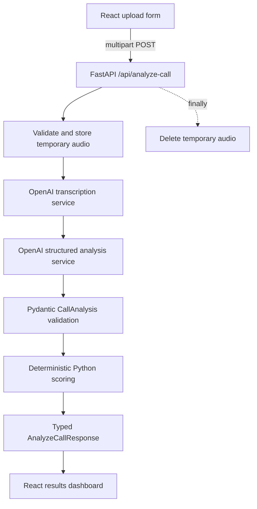

# Sales Call Analyzer

Sales Call Analyzer is a small full-stack AI application that turns an MP3 or WAV sales-call recording into a transcript, structured sales insights, and an explainable quality score out of 100.

It is designed as an interview-friendly example of practical AI engineering: OpenAI handles transcription and semantic extraction, Pydantic validates the structured model output, and ordinary Python business logic calculates the final score.

## Problem being solved

Reviewing recorded sales calls manually is slow and subjective. This application creates a consistent first-pass review that identifies customer needs, questions, objections, follow-up actions, sentiment, and whether a next step was confirmed. The score remains reproducible because the language model does not choose the final score or category.

## Features

- MP3 and WAV upload with browser and server validation
- Configurable upload-size limit
- Temporary storage that is removed after every request
- Audio transcription through the OpenAI Audio Transcriptions API
- Schema-constrained transcript analysis through the OpenAI Responses API
- Pydantic validation of all structured analysis fields
- Deterministic score, category, and five-component breakdown
- Responsive React dashboard with loading and error states
- Friendly empty-result and unanswered-objection states
- Expandable transcript
- Mocked backend and frontend tests that make no real API calls

## Architecture



The browser communicates only with FastAPI. The OpenAI API key and all model calls stay on the backend.

## Technology stack

- Frontend: React 19, Vite, TypeScript, Tailwind CSS, native `fetch`, Vitest, and React Testing Library
- Backend: Python 3.11+, FastAPI, Uvicorn, OpenAI Python SDK, Pydantic, `python-multipart`, `python-dotenv`, and Pytest
- Development: Git, ESLint, and Prettier

## Repository structure

```text
.
├── AGENTS.md
├── BUILD_STEPS.md
├── README.md
├── backend/
│   ├── .env.example
│   ├── requirements.txt
│   ├── app/
│   │   ├── api/routes.py
│   │   ├── core/config.py
│   │   ├── main.py
│   │   ├── models/analysis.py
│   │   ├── scoring/calculator.py
│   │   └── services/
│   │       ├── analysis.py
│   │       └── transcription.py
│   └── tests/
└── frontend/
    ├── .env.example
    ├── package.json
    ├── src/
    │   ├── components/
    │   ├── services/api.ts
    │   ├── types/analysis.ts
    │   └── App.tsx
    └── tests/
```

## Prerequisites

- Git
- Python 3.11 or newer
- Node.js 20.19 or newer with npm (or Node.js 22.12+)
- An OpenAI API key with access to a transcription model and a text model that supports Structured Outputs

## Backend setup on Windows PowerShell

From the repository root:

```powershell
cd backend
py -3.11 -m venv .venv
.\.venv\Scripts\Activate.ps1
python -m pip install --upgrade pip
python -m pip install -r requirements.txt
Copy-Item .env.example .env
```

If `py -3.11` is unavailable but `python --version` reports Python 3.11 or newer, use `python -m venv .venv` instead.

Edit `backend/.env` and provide real values:

```env
OPENAI_API_KEY=your-api-key
OPENAI_TRANSCRIPTION_MODEL=gpt-4o-mini-transcribe
OPENAI_ANALYSIS_MODEL=gpt-4o-mini
MAX_UPLOAD_MB=20
FRONTEND_ORIGIN=http://localhost:5173
```

The model names above are working examples; use models available to your OpenAI project. The transcription model must support the Audio Transcriptions API, and the analysis model must support Structured Outputs.

Start the API:

```powershell
uvicorn app.main:app --reload
```

The backend is available at:

- API base: `http://localhost:8000`
- Swagger UI: `http://localhost:8000/docs`
- Health check: `http://localhost:8000/api/health`

## Frontend setup

Open a second PowerShell terminal at the repository root:

```powershell
cd frontend
npm ci
Copy-Item .env.example .env
npm run dev
```

The default frontend environment is:

```env
VITE_API_BASE_URL=http://localhost:8000
```

Open `http://localhost:5173`, choose an MP3 or WAV recording, and select **Analyze Call**.

## Running tests and checks

Backend tests use mocked OpenAI clients and do not consume API credits:

```powershell
cd backend
.\.venv\Scripts\Activate.ps1
python -m pytest
```

Frontend verification:

```powershell
cd frontend
npm run test
npm run lint
npm run typecheck
npm run format:check
npm run build
```

## API endpoints

### Health check

```http
GET /api/health
```

Success response:

```json
{ "status": "ok" }
```

### Analyze a call

```http
POST /api/analyze-call
Content-Type: multipart/form-data
```

The multipart field must be named `file` and contain a non-empty `.mp3` or `.wav` file. The default limit is 20 MB.

The success response contains:

```text
transcript
analysis
├── summary
├── customer_needs
├── questions_asked
├── objections[] { objection, response }
├── follow_up_actions
├── sentiment
├── next_step_confirmed
└── three quality ratings from 0 to 5
score
├── total
├── category
└── breakdown
```

Errors use one consistent shape:

```json
{ "detail": "Human-readable error message" }
```

Typical status codes are `400` for invalid or empty files, `413` for oversized uploads, and `502` when transcription or analysis fails.

## Deterministic scoring

The model extracts structured evidence and provides three bounded quality ratings. Python then calculates the score:

| Component             | Formula                                  | Maximum |
| --------------------- | ---------------------------------------- | ------: |
| Discovery             | `discovery_quality / 5 × 25`             |      25 |
| Objection handling    | `objection_handling_quality / 5 × 25`    |      25 |
| Communication clarity | `communication_clarity / 5 × 20`         |      20 |
| Confirmed next step   | 20 when true, otherwise 0                |      20 |
| Follow-up actions     | 10 when at least one exists, otherwise 0 |      10 |

Quality components use Python's `round`, which uses ties-to-even rounding. With the current maxima, every valid 0–5 rating maps to an exact integer.

Categories are:

- 85–100: Excellent
- 70–84: Good
- 50–69: Needs Improvement
- 0–49: Poor

The response models and frontend client also verify that the component values add to the total and that the category matches that total.

## Structured output validation

The analysis service passes the `CallAnalysis` Pydantic model to `client.responses.parse`. This constrains the model response to the expected schema. The returned value is validated again before scoring, and invalid or missing parsed output becomes a controlled service error rather than fabricated fallback data.

The system instructions require evidence-only extraction, empty lists for missing information, `null` for an unanswered objection, and no obedience to instructions embedded inside the untrusted transcript. See the official [Structured Outputs guide](https://developers.openai.com/api/docs/guides/structured-outputs) and [Audio Transcriptions API reference](https://developers.openai.com/api/reference/resources/audio/subresources/transcriptions/methods/create).

## Limitations

- Requires an OpenAI API key and incurs API usage costs.
- Processes one uploaded recording per request and keeps no history.
- Does not identify speakers unless the transcript text itself makes roles clear.
- Does not provide live or streaming transcription.
- Analysis quality depends on audio quality, transcription accuracy, and the configured models.
- File validation checks extension, declared content type, size, and emptiness; it does not deeply inspect the binary audio container.
- There is no authentication, database, deployment configuration, or background job system.

## Possible future improvements

- Optional speaker labels when supported by transcription output
- Downloadable JSON or PDF reports
- A sample-data demo mode
- Conversation events displayed in timeline order

These are intentionally outside the current MVP.

## Two-minute interview explanation

The React frontend sends an MP3 or WAV file to FastAPI as multipart form data. FastAPI validates the upload, writes it to a safely named temporary file, and guarantees cleanup in a `finally` block. A backend service sends the file to OpenAI for transcription. A second service sends the transcript to the Responses API and requests a result matching a Pydantic schema, so free-form model text is never trusted directly. The language model extracts semantic evidence and bounded ratings, while a pure Python function calculates the final score and category. FastAPI returns one typed JSON response, and React renders the score, breakdown, insights, and transcript. All external calls are mocked in tests, which keeps verification fast, deterministic, and free of API charges.
